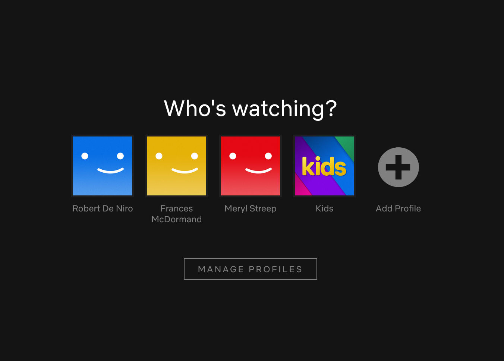

# Remember my netflix profile

The goal of this extension is to get rid of this page:

The cookie used by Netflix to store the profile is expring 30 minutes after being created. This extension extends the expiration date to first of January 2021. 

It has been developed thanks to [this repo](https://github.com/samuelsimoes/chrome-extension-webpack-boilerplate).

## To run it on your machine

1. Check if your Node.js version is >= 6.
2. Clone the repository.
3. Install [yarn](https://yarnpkg.com/lang/en/docs/install/).
4. Run `yarn`.
5. Run `npm run start`
6. Load your extension on Chrome following:
    1. Access `chrome://extensions/`
    2. Check `Developer mode`
    3. Click on `Load unpacked extension`
    4. Select the `build` folder.
7. Have fun.
